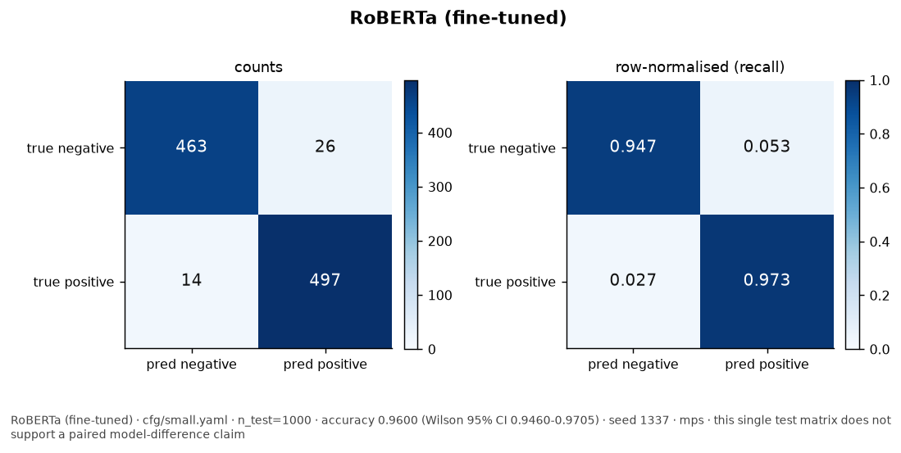
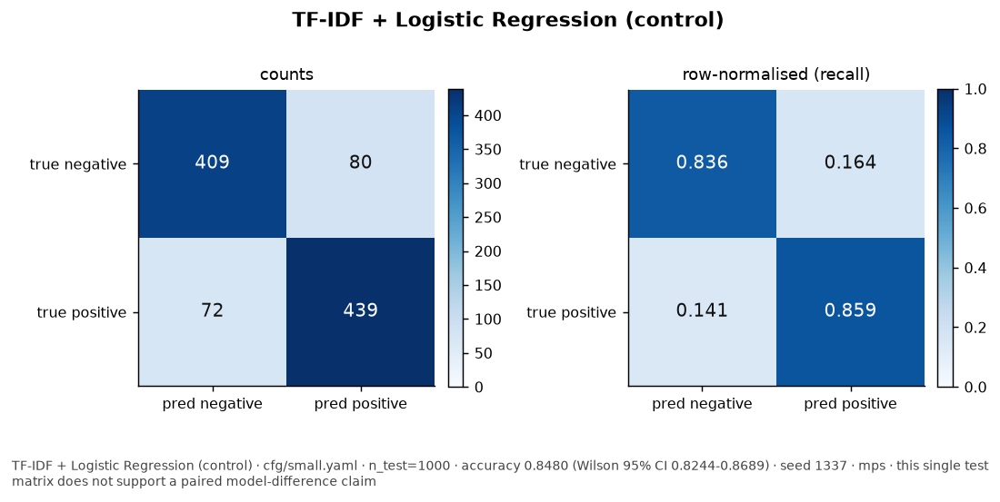
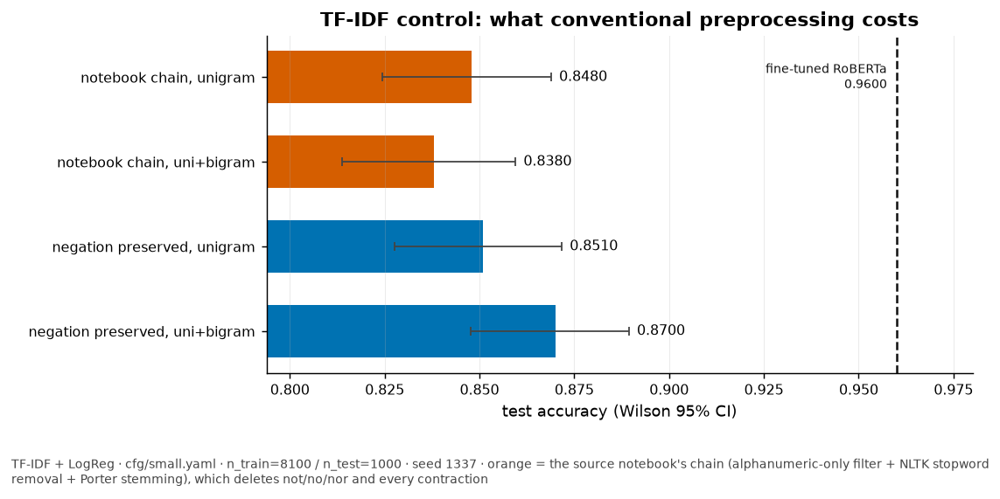
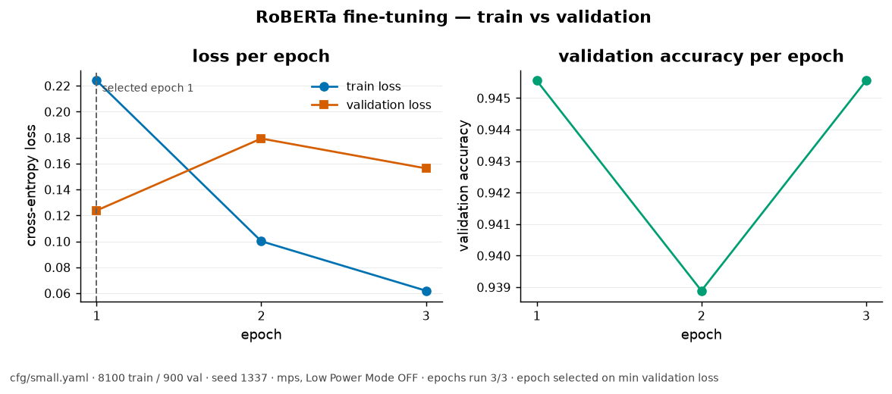
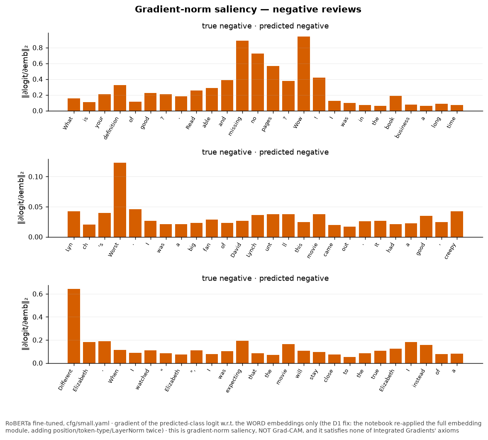
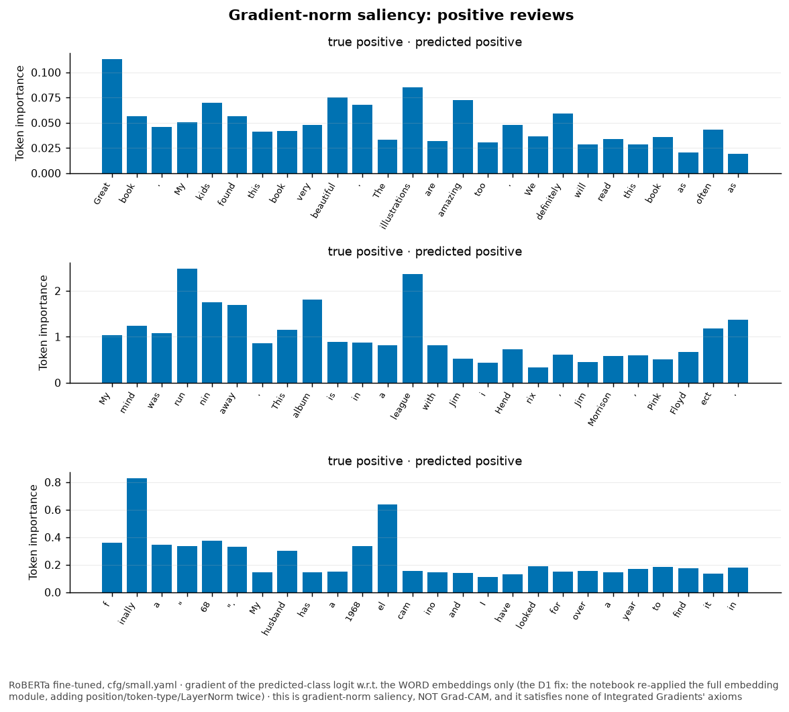
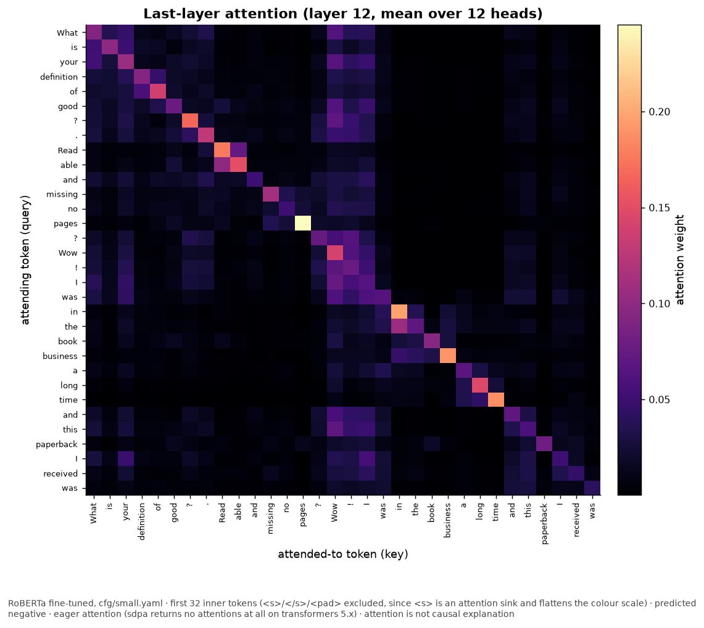
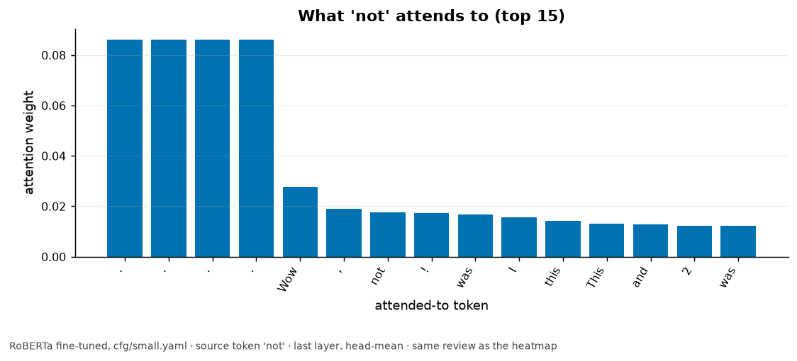
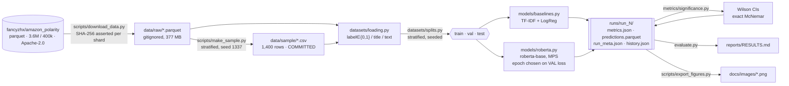

# Sentiment Polarity on Amazon Reviews — RoBERTa Fine-Tuning vs. a TF-IDF Control

[](.github/workflows/ci.yml)
[](#testing)
[](#testing)
[](pyproject.toml)
[](LICENSE)

A reproducible fine-tuning study that re-runs a published coursework notebook end to end and reports
what actually came out. The tension: Amazon polarity is close to linearly separable in bag-of-words
space, so a well-configured linear model is a serious opponent rather than a straw man — and the
notebook's own preprocessing chain was quietly deleting every negation marker from it.

**Does fine-tuning `roberta-base` on 9,000 reviews beat TF-IDF + logistic regression by a margin that
survives a 1,000-example test set?**

**Yes — by 11.2 percentage points, `0.9600` vs `0.8480`, exact McNemar p = 1.98e-21.** The gap is not
close and is not in doubt at this scale. Two things that *were* in doubt turned out more interesting:
the notebook's 5-epoch schedule would have **overfit** (validation loss bottomed at epoch 1), and
repairing the baseline's negation handling recovered 2.2 points but **not** significantly
(paired p = 0.076).

- **Focus** — binary sentiment polarity, with token-level interpretability
- **Data** — [Amazon Review Polarity](https://huggingface.co/datasets/fancyzhx/amazon_polarity)
  (Zhang, Zhao & LeCun, NeurIPS 2015) · 3.6M train / 400K test available, public and ungated,
  Apache-2.0 · a documented 9,000-row subset is used, see [`data/README.md`](data/README.md)
- **Stack** — Python 3.12 · PyTorch 2.13 (MPS) · `transformers` 5.14 · scikit-learn · NLTK · statsmodels
- **Hardware** — Apple Silicon, 32 GB, **MPS fp32, no CUDA**. No cloud spend.
- **Output** — a measured leaderboard with Wilson intervals and a paired McNemar test, a four-cell
  preprocessing ablation, and eight committed interpretability figures

📄 **[Read the full results & analysis →](reports/RESULTS.md)**

## Provenance

This began as a **coursework notebook for an M.S. Data Science & AI course at FIU** and was published
to Kaggle as
[Sentiment Analysis using RoBERTa](https://www.kaggle.com/code/armandogon94/sentiment-analysis-using-roberta)
(Apache-2.0). The original is preserved unmodified at
[`notebooks/sentiment_analysis_roberta_ORIGINAL.ipynb`](notebooks/sentiment_analysis_roberta_ORIGINAL.ipynb).

All 28 of its code cells were saved with `outputs: []` and `execution_count: null`, so **none of the
metrics below existed anywhere until this repo re-ran both models locally** on Apple Silicon. That is
not a gap to hide — it is why "re-run it and see" was the first real task. Details, including the
forensic evidence that the notebook was run locally and uploaded unexecuted:
[`docs/PROVENANCE.md`](docs/PROVENANCE.md).

---

## Key Findings

- **The transformer wins clearly at this scale.** `0.9600` [0.9460, 0.9705] against the control's
  `0.8480` [0.8244, 0.8689]. They disagree on 152 of 1,000 test examples; RoBERTa alone is right on
  132 of those and the control alone on 20. Exact McNemar **p = 1.98e-21**. `cfg/small.yaml`.
- **The notebook's 5 epochs would have overfit — this is the thing that did not work.** With a
  validation split added, validation loss *bottomed at epoch 1* (`0.1238`) and rose at epoch 2
  (`0.1793`) while training loss kept falling. Epoch 1 was selected and the test set scored once. The
  extra epochs were not merely expensive; they were harmful. The original notebook had no validation
  split, so this was invisible to it.
- **Conventional preprocessing does cost the control real points — but not significantly here.**
  Across the ablation grid the control moves `0.8380` → `0.8700` (3.2 pp). The best cell beats the
  notebook's chain by 2.2 pp, and the *paired* McNemar over their 140 disagreements gives
  **p = 0.076** — directionally right, not resolvable on 1,000 examples. Published as measured.
- **Adding bigrams to the notebook's chain makes it worse** (`0.8480` → `0.8380`). Once
  `not` / `no` / `n't` have been deleted, bigrams add 226,000 features and no signal. The same bigrams
  on negation-preserving text produce the best cell in the grid. That contrast is the whole point.
- **`max_len=256` truncates almost nothing.** Measured, not assumed: **0.1%** of test reviews (1 of
  1,000; median 92 tokens, p95 204, max 304). The sequence budget was not a constraint here.

---

## Results

| Model | Accuracy (Wilson 95% CI) | Precision (macro) | Recall (macro) | F1 (macro) | Train time | Config |
|---|---|---|---|---|---|---|
| **RoBERTa (fine-tuned)** | **0.9600** [0.9460, 0.9705] (±1.2 pp) | 0.9605 | 0.9597 | 0.9600 | 32m 08s (MPS, Low Power Mode OFF) | `cfg/small.yaml` |
| TF-IDF + Logistic Regression (control) | 0.8480 [0.8244, 0.8689] (±2.2 pp) | 0.8481 | 0.8478 | 0.8479 | 4s (CPU, Low Power Mode OFF) | `cfg/small.yaml` |

<sub>seed 1337 · n_train 8,100 (+900 validation) / n_test 1,000 · exact **McNemar p = 1.98e-21** on
152 discordant pairs · reproduce with <code>uv run python train.py -c cfg/small.yaml</code> · commit
<code>dcf8b09</code> · 124,647,170 parameters · epoch selected on validation loss, test set scored
once.</sub>

**The observed gap of 11.2 percentage points has McNemar p = 1.98e-21; on this 1,000-example test set
it is comfortably distinguishable from zero.** The Wilson intervals do not overlap either, but the
paired test is the one that answers the question — both models scored the *same* examples, so the
effective sample size for the comparison is the 152 disagreements, not the 1,000 rows.





### The control is a genuine control, not a formality

Amazon Review Polarity is close to linearly separable in bag-of-words space — "refund", "waste",
"flawless" and "returned" are not subtle — and a well-configured linear model on 8,100 examples is a
real opponent. It lands 11.2 points behind a 125M-parameter transformer while fitting in **4 seconds
on one CPU** against 32 minutes on the GPU. That ratio is the useful number for anyone deciding
whether a transformer is worth the budget on a task shaped like this one.

It is also reported here **after** being given its best shot: the ablation below repairs the
preprocessing chain that was handicapping it, and the transformer still wins.

### Baseline preprocessing ablation — the notebook's chain was deleting negation

The original chain was: lowercase → keep only `^\w+$` tokens → remove NLTK English stopwords → Porter
stem, then unigram TF-IDF. It deletes negation twice over: `not`, `no` and `nor` are NLTK English
stopwords, and the `^\w+$` filter destroys `n't` *before* the stopword filter runs. With unigrams
only, **`"not good"` and `"good"` become the same feature vector** — on the one task where negation
decides the label. ([`tests/test_text_preprocess.py`](tests/test_text_preprocess.py) asserts exactly
that, in both directions.)

| Preprocessing | n-grams | Accuracy (Wilson 95% CI) | F1 (macro) | Vocabulary | Config |
|---|---|---|---|---|---|
| notebook chain (alnum filter + stopwords removed + Porter stem) | (1, 1) | 0.8480 [0.8244, 0.8689] | 0.8479 | 20,938 | `cfg/small.yaml` |
| notebook chain (alnum filter + stopwords removed + Porter stem) | (1, 2) | 0.8380 [0.8139, 0.8595] | 0.8378 | 247,041 | `cfg/small.yaml` |
| negation preserved (no filter, no stopword removal, no stemming) | (1, 1) | 0.8510 [0.8276, 0.8717] | 0.8510 | 30,449 | `cfg/small.yaml` |
| **negation preserved** (no filter, no stopword removal, no stemming) | **(1, 2)** | **0.8700** [0.8477, 0.8894] | 0.8700 | 275,634 | `cfg/small.yaml` |

<sub>Same splits, same seed 1337, same 1,000 test rows as the table above. Reproduce with
<code>uv run python train.py -c cfg/small.yaml -p cfg/baseline_ablation.json --baselines-only</code>.</sub>

**The honest reading: directionally real, statistically unresolved.** Best cell against the
notebook's chain is 2.2 points over 140 disagreements, exact McNemar **p = 0.076** — it does not
clear 0.05. What *is* unambiguous is the mechanism, which needs no test:

| Cell | Negation markers among the 20 most negative coefficients |
|---|---|
| notebook chain, unigram | *none — deleted before vectorisation* |
| notebook chain, uni+bigram | *none — deleted before vectorisation* |
| negation preserved, unigram | `not`, `n't`, `no` |
| negation preserved, uni+bigram | `not`, `n't`, `no`, `not worth` |

The tokens the model would most like to use are simply absent from the first two rows. And the best
cell still trails the transformer by 9.0 points, so **the fair version of the baseline does not close
the gap** — worth reporting precisely because the opposite would have been the better story.



### Why 3 epochs, and why 5 would have been worse



| Epoch | Train loss | Validation loss | Validation accuracy | Wall clock |
|---|---|---|---|---|
| **1** | 0.2240 | **0.1238** | 0.9456 | 10m 26s |
| 2 | 0.1001 | 0.1793 | 0.9389 | 11m 09s |
| 3 | 0.0620 | 0.1563 | 0.9456 | 10m 33s |

Training loss falls monotonically; validation loss does not. The source notebook had **no validation
split at all**, which made its choice of 5 epochs unjustifiable — there was nothing to early-stop on,
and picking the epoch by test accuracy would have been leakage dressed up as model selection.

---

## Interpretability

The part most similar projects skip, and the reason this repo has two defects worth reading about.

### Gradient-norm saliency — not Grad-CAM, and not what the notebook computed





Two corrections are baked into these figures.

**The method is named correctly.** The notebook called this "Grad-CAM". It computes
`‖∂logit_target/∂embedding_t‖₂` — gradient-norm saliency. Grad-CAM pools gradients per channel and
weights the *activations* of a chosen layer, then applies ReLU. Different method, different
guarantees. Renaming it and explaining why is a stronger signal than shipping a mislabelled one.
([ADR 0005](docs/adr/0005-gradient-saliency-not-gradcam.md))

**The gradient is taken w.r.t. the *word* embeddings only — the notebook's version was computed on a
distorted input.** It did:

```python
embeddings = model.roberta.embeddings(input_ids=input_ids)  # the FULL embedding module
outputs = model(inputs_embeds=embeddings, attention_mask=mask)
```

`RobertaEmbeddings.forward` does word lookup **plus** position embeddings, token-type embeddings,
LayerNorm and dropout. Passing its output back in as `inputs_embeds` runs all of that a *second*
time. Every attribution the notebook produced was taken on an input distribution the model had never
seen in training. The fix is one line, and it is exactly testable — in `eval()` mode dropout is off,
so the word-embedding path must reproduce the `input_ids` logits bit for bit:

```text
logits(input_ids)  vs  logits(word_embeddings(input_ids))   →  max |Δ| = 0.0     ← the fix
logits(input_ids)  vs  logits(FULL embeddings(input_ids))   →  max |Δ| ≠ 0       ← the bug
```

Both assertions live in [`tests/test_attribution.py`](tests/test_attribution.py), the broken one as a
strict `xfail` that names the bug — plus a third test proving the two paths really do differ, so the
`xfail` can never quietly go vacuous.

### Attention





`<s>` and `</s>` are excluded: RoBERTa's `<s>` is an attention sink, and leaving it in flattens every
real token to the bottom of the colour scale.

Getting these figures at all required fixing a silent no-op. The notebook passed
`attn_implementation="eager"` to `RobertaConfig.from_pretrained`, where nothing reads it —
`transformers` reads the private `config._attn_implementation`. On `transformers` 5.x the default is
`sdpa`, and **`sdpa` returns an empty attentions tuple with only a warning**, so today that code
would produce blank figures rather than slightly wrong ones. Verified locally:

```text
attn_implementation="sdpa"   →  len(out.attentions) == 0
attn_implementation="eager"  →  len(out.attentions) == 12
```

`interpretability/attention.py` now raises on a non-eager model instead of plotting nothing.

**What these figures do not claim:** attention weight is not causal importance, and gradient-norm
saliency satisfies none of Integrated Gradients' axioms. Full treatment in
[`docs/interpretability.md`](docs/interpretability.md).

---

## Architecture



Both models consume the *same* `Splits` object and write into the *same* run directory in one
process. That is what makes the leaderboard like-for-like rather than two numbers that happen to
share a table — and it is what makes McNemar possible at all, because the paired predictions for both
models exist for the same 1,000 rows in one `predictions.parquet`.

A second diagram — a sequence diagram of the attribution path, which is exactly where the
double-embedding bug lived — is in [`docs/architecture.md`](docs/architecture.md). Both are exported
to [`docs/diagrams/`](docs/diagrams) as SVG by `scripts/export_diagrams.sh`.

---

## Repository Structure

```bash
33-sentiment-roberta/
├── cfg/                      # 5 YAML configs + Pydantic schema; *.json = the ablation grid
├── data/                     # gitignored except data/sample/ — provenance in data/README.md
├── datasets/                 # loading, stratified splits, the TF-IDF chain, torch Dataset
├── models/                   # TF-IDF control + RoBERTa behind one Protocol, plus the registry
├── metrics/                  # classification metrics · Wilson CIs · exact McNemar
├── interpretability/         # attention maps + gradient saliency (the D1 fix lives here)
├── utils/                    # seeding, device, run dirs, run metadata, logging, plots, NLTK
├── notebooks/                # the ORIGINAL Kaggle notebook + a re-run narrative walkthrough
├── scripts/                  # download_data | make_sample | export_figures | export_diagrams
├── tests/                    # 130 tests — leakage, config, metric parity, D1, D3, D8, smoke
├── reports/                  # RESULTS.md (generated) + figures/
├── docs/                     # PROGRESS · PROVENANCE · architecture · interpretability · adr/
├── train.py                  # THE entrypoint: train.py -c cfg/small.yaml
├── evaluate.py               # runs/latest → reports/RESULTS.md
└── Makefile                  # setup | data | smoke | dev | small | ablation | figures | report
```

---

## Quickstart

No dataset download. The committed 1,000-row sample and a locally-built random-weight model make the
whole pipeline run in seconds:

```bash
git clone <this repo> && cd 33-sentiment-roberta
make setup          # uv sync + pre-commit hooks
make smoke          # full pipeline on data/sample/, CPU, ~6 s
make test           # 130 tests, no network
```

`make smoke` uses random weights on purpose — it verifies the *plumbing*, and its accuracy is
deliberately meaningless and published nowhere ([ADR 0007](docs/adr/0007-offline-smoke-path.md)).

To reproduce the published numbers (~377 MB download, ~35 min on Apple Silicon):

```bash
make data                                                  # HF parquet, SHA-256 verified
uv run python train.py -c cfg/dev.yaml                     # ~2 min calibration run first
uv run python train.py -c cfg/small.yaml                   # THE published run, ~32 min
uv run python train.py -c cfg/small.yaml -p cfg/baseline_ablation.json --baselines-only
uv run python evaluate.py -i runs/run_2 -a runs/run_3 -o reports/RESULTS.md
uv run python scripts/export_figures.py -i runs/run_2 -a runs/run_3 -o docs/images
```

**Requires** Python 3.12+ and [uv](https://docs.astral.sh/uv/). No CUDA, no Docker, no cloud account.

---

## Configuration

Five configs. **Which ones were actually run is stated here and in each file** — three were, two were
not, and no number in this repo comes from the two that were not.

| File | Scale (train / val / test) | Epochs | Ran? | Purpose |
|---|---|---|---|---|
| `cfg/smoke.yaml` | committed sample, random weights, CPU | 1 | ✅ | CI + fresh clone. Publishes nothing. |
| `cfg/dev.yaml` | 1,800 / 200 / 500, seq 128 | 1 | ✅ | Calibration. Its numbers are labelled `dev` wherever they appear. |
| `cfg/small.yaml` | 8,100 / 900 / 1,000, seq 256 | 3 | ✅ | **Every headline number above.** |
| `cfg/default.yaml` | 8,100 / 900 / 1,000, seq 256 | 5 | ❌ | The notebook's exact configuration. Projected 51–55 min — over this repo's 45-minute wall-clock cap. |
| `cfg/full.yaml` | 180,000 / 20,000 / 20,000 | 5 | ❌ | Derived at 36–69 h on MPS fp32. Committed as a record of scope, not an invitation. |

`cfg/small.yaml` is the notebook's data scale and every one of its hyperparameters, with two stated
departures: 3 epochs instead of 5 (a compute bound, sized from a measured 2.46 s/step), and a 10%
stratified validation split the notebook lacked (a correctness fix — see the training curves above).
Reasoning: [ADR 0004](docs/adr/0004-subset-size-and-published-config.md).

Every run is bounded. `train.py` measures the per-epoch rate after epoch 1, logs the projected total,
and refuses to *start* an epoch that projection says cannot finish inside `WALL_CLOCK_CAP_MIN`; a
truncated run records `wall_clock_capped: true` rather than pretending otherwise. It also refuses to
start above a 1-minute load average of 12 without `--force`.

<details>
<summary>Example <code>cfg/small.yaml</code></summary>

```yaml
SEED: 1337
DATA:
  TRAIN_PATH: data/raw/train.parquet
  ROWS_READ_TRAIN: 200000        # rows parsed from the parquet…
  N_TRAIN: 9000                  # …of which this many are used. Two knobs, not a coincidence.
  N_TEST: 1000
  VAL_FRACTION: 0.1
MODEL:
  PRETRAINED: roberta-base
  MAX_LEN: 256
  BATCH_SIZE: 32
  EPOCHS: 3
  LR: 2.0e-5
RUNTIME:
  DEVICE: auto
  WALL_CLOCK_CAP_MIN: 45.0       # hard cap, not advisory
```
</details>

---

## Reproducibility

- **One seed, `1337`**, threaded through the sample, the split, the vectorizer, every estimator, and
  `torch` / `torch.mps` / `PYTHONHASHSEED`. The original notebook seeded only two `pandas.sample`
  calls, leaving `DataLoader` shuffle, dropout and the classifier head's initialisation unseeded.
- **Every run writes `runs/run_N/run_meta.json`**: git SHA, resolved config, library versions,
  device, macOS Low Power Mode state, and the 1-minute load average at launch.
- **Per-example predictions are persisted** to `runs/run_N/predictions.parquet`, so McNemar can be
  recomputed without re-training.
- **The numbers above were produced by commit `dcf8b09`**, on MPS with Low Power Mode OFF.
- **Timings are honest about their conditions.** Both runs happened with other work on the machine
  (1-minute load average 9.5 at the launch of the published run). They are pessimistic upper bounds,
  not clean benchmarks.

## Testing

```bash
make test           # 130 tests, coverage on the pure-logic core
make lint           # ruff check + ruff format --check + mypy
make verify         # clone committed HEAD to a temp dir and run the documented quickstart
```

**130 tests, 95% coverage** on `datasets/ models/ metrics/ interpretability/ utils/`. Nothing in the
suite touches the network. The ones that carry the most weight:

| File | Asserts |
|---|---|
| `test_attribution.py` | **D1** — `logits(input_ids) ≈ logits(word_embeddings(ids))`, plus a strict `xfail` reproducing the double-embedding bug and a guard so it cannot go vacuous |
| `test_text_preprocess.py` | **D3** — `"not good"` and `"good"` collapse to one vector under the notebook's chain and separate under the fixed one |
| `test_splits.py` | leakage — disjoint index sets, no shared text, and a vectorizer vocabulary provably free of a marker token present in every test row |
| `test_loading.py` | the label-flip trap — HF `{0,1}` and Kaggle `{1,2}` must normalise to identical frames |
| `test_metrics.py` | Wilson against `statsmodels` to 1e-9; McNemar against a 2×2 computed by hand in the docstring |
| `test_attention.py` | **D8** — an `sdpa` model raises rather than silently plotting nothing |
| `test_utils.py` | parses every `.py` with `ast` to prove no unguarded `plt.show()` survives |

CI runs lint → types → tests → an offline smoke train → figure and report regeneration on Python 3.12
and 3.13, plus a `docs-drift` job that fails if any path in the tree above stops existing, or if any
number in this README stops tracing to a committed report.

---

## Limitations

1. **8,100 training rows — 0.22% of the 3.6M available.** Laptop-scale by choice. Nothing here
   transfers to full-data training, where the literature reports single-digit error rates for both
   model families.
2. **A 1,000-example test set gives Wilson intervals up to ±2.2 pp.** The 11.2-point headline gap
   clears that easily; the 2.2-point ablation gap does not, and is reported as unresolved.
3. **One seed, one split, one run per config.** No repeated-CV variance estimate — the run-to-run
   standard deviation is *unknown*, not small. This is the top item in
   [`docs/PROGRESS.md`](docs/PROGRESS.md)'s NEXT ACTION.
4. **MPS fp32 only** — no mixed precision, no `torch.compile`. Timings are not comparable to CUDA
   figures in papers, and both runs shared the machine with other work.
5. **Gradient-norm saliency is not axiomatically attributive.** It is a first-order local
   sensitivity; where a logit has saturated, gradients are small regardless of importance. Integrated
   Gradients is the principled upgrade and is not implemented here.
6. **Attention weights are not explanations.** High attention is not causal importance. These figures
   show where the model looks, which is a weaker claim than attribution.
7. **Amazon reviews circa 2013.** Domain shift to any other review corpus is unmeasured.
8. **The interpretability figures use hand-picked reviews** — the notebook's
   `iloc[5, 7, 9, 11, 13, 16]`, kept so the notebook and this README discuss the same examples. They
   illustrate; they do not measure.
9. **`cfg/default.yaml` and `cfg/full.yaml` have not been run.** A reader wanting the notebook's exact
   5-epoch result will not find it here.

## Data

[Amazon Review Polarity](https://huggingface.co/datasets/fancyzhx/amazon_polarity) — 3.6M train /
400K test, Apache-2.0, public and ungated, constructed for
[Zhang, Zhao & LeCun, *Character-level Convolutional Networks for Text Classification*, NeurIPS 2015](https://papers.nips.cc/paper_files/paper/2015/hash/250cf8b51c773f3f8dc8b4be867a9a02-Abstract.html).

Not committed. Two small stratified samples are (1,400 rows, 615 KB total), so tests and the
quickstart run with no download. Measured class balance of the rows actually read — 50.58% positive
in the first 200,000 train rows, 51.07% in the first 20,000 test rows — plus the schema, both
provenance URLs and the shard checksums: [`data/README.md`](data/README.md).

## License

**Apache-2.0** — see [LICENSE](LICENSE). This matches the licence of the original Kaggle notebook
this repo was built from, so the provenance chain stays consistent. Third-party attributions
(`roberta-base` weights, MIT; the dataset, Apache-2.0) are in [NOTICE](NOTICE).

## Author

Armando Gonzalez — ex-software engineer (fintech), M.S. Data Science & AI.
