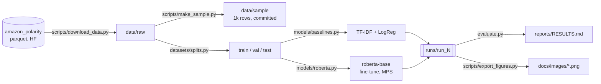

# Sentiment Polarity on Amazon Reviews — RoBERTa Fine-Tuning vs. a TF-IDF Control

[](pyproject.toml)
[](LICENSE)
[](docs/PROGRESS.md)

> **Status: scaffolding — no results yet.**
> The source notebook was published to Kaggle with its cell outputs unsaved, so **no metric for
> either model currently exists**. Both models must be re-run locally before any number appears
> in this README. Progress: [`docs/PROGRESS.md`](docs/PROGRESS.md).

A reproducible fine-tuning study: does a 125M-parameter transformer beat a properly configured
TF-IDF + logistic regression control on binary review polarity, at laptop data scale and with no
GPU? The tension is that Amazon polarity is close to linearly separable in bag-of-words space, so
the linear control is a serious opponent rather than a straw man.

**Does fine-tuning `roberta-base` on 9,000 reviews beat TF-IDF + logistic regression by a margin
that survives a 1,000-example test set?**

- **Focus** — binary sentiment polarity, with token-level interpretability
- **Data** — [Amazon Review Polarity](https://huggingface.co/datasets/fancyzhx/amazon_polarity)
  (Zhang, Zhao & LeCun, NeurIPS 2015), 3.6M train / 400K test available, public and ungated,
  Apache-2.0. A documented subset is used — see [`data/README.md`](data/README.md).
- **Stack** — Python 3.12 · PyTorch (MPS) · `transformers` · scikit-learn · NLTK
- **Hardware** — Apple Silicon MacBook Pro, 32 GB, **MPS, no CUDA**. No cloud spend.
- **Output** — a measured leaderboard with Wilson confidence intervals and a paired McNemar test,
  plus committed attention and gradient-saliency figures

## Provenance

This began as a **coursework notebook for an M.S. Data Science & AI course at FIU** and was
published to Kaggle as
[Sentiment Analysis using RoBERTa](https://www.kaggle.com/code/armandogon94/sentiment-analysis-using-roberta)
(Apache-2.0). The original is preserved unmodified at
[`notebooks/sentiment_analysis_roberta_ORIGINAL.ipynb`](notebooks/sentiment_analysis_roberta_ORIGINAL.ipynb).

Its 28 code cells were saved with **zero outputs and no execution counts**, so none of the metrics
this repo will report existed anywhere before it re-ran both models locally on Apple Silicon.
Details: [`docs/PROVENANCE.md`](docs/PROVENANCE.md).

---

## Results

> **Not yet measured.** This table stays empty until the numbers come out of a local run and are
> written to `runs/<run_id>/metrics.json`. No placeholder, estimated, or literature-derived value
> will be entered here.

| Model | Accuracy (95% CI) | Precision | Recall | F1 | Train time | Config |
|---|---|---|---|---|---|---|
| RoBERTa (fine-tuned) | — | — | — | — | — | — |
| TF-IDF + Logistic Regression (control) | — | — | — | — | — | — |

<sub>Every row will name the config that produced it. Accuracy will carry a Wilson 95% interval —
on a 1,000-example test set that interval is roughly ±1.5 percentage points, so small gaps are not
resolvable. The two models are evaluated on the same examples, so the comparison will be tested with
an exact McNemar test on paired predictions, not two independent proportion tests.</sub>

**The TF-IDF control is a genuine control, not a formality.** How close it gets will be reported
whatever the answer, including the case where it is very close. A planned ablation examines whether
the conventional preprocessing chain (stopword removal + Porter stemming) is destroying negation —
NLTK's English stopword list contains `not`, `no`, and `nor` — and therefore handicapping the
control on the one task where negation is decisive.

## Interpretability

The strongest asset in this repo, and the part most similar projects skip: last-layer attention
heatmaps, per-token attention, and gradient-based token attribution over hand-picked positive and
negative reviews. Figures will be generated by a committed script (`make figures`) into
`docs/images/` and embedded here — never hand-exported.

Method naming is precise on purpose: the attribution used is **gradient-norm saliency**, not
Grad-CAM. See [`docs/interpretability.md`](docs/interpretability.md).

## Architecture



Both models consume the same splits and write to the same run directory, so the leaderboard compares
like with like and every published number is traceable to one `run_meta.json`.

## Repository Structure

```bash
33-sentiment-roberta/
├── cfg/                      # dev | default | scaled configs + Pydantic schema
├── data/                     # gitignored except data/sample/ — see data/README.md
├── datasets/                 # loading, splits, text preprocessing, torch Dataset
├── models/                   # TF-IDF control + RoBERTa, behind one Protocol
├── metrics/                  # classification metrics + Wilson CI + McNemar
├── interpretability/         # attention maps + gradient saliency
├── utils/                    # seeding, device, run dirs, logging, plots
├── notebooks/                # ORIGINAL Kaggle notebook + a re-run narrative walkthrough
├── scripts/                  # download_data | make_sample | export_figures | verify_fresh_clone
├── tests/                    # pytest — leakage, config, metric parity, attribution, smoke
├── reports/                  # RESULTS.md + figures/
├── docs/                     # PROGRESS, PROVENANCE, architecture, ADRs, diagrams, images
├── train.py                  # single config-driven entrypoint
└── evaluate.py               # runs/latest → reports/RESULTS.md
```

Directories appear here as they are built; `docs/PROGRESS.md` tracks what exists today.

## Quickstart

Not yet runnable — see [`docs/PROGRESS.md`](docs/PROGRESS.md). When it is, the quickstart will run
against the committed 1,000-row sample in minutes with no dataset download.

## Reproducibility

- A single `SEED` threaded through the split, the vectorizer, and every estimator, including
  `torch` and `torch.mps`.
- Each run writes `runs/run_N/run_meta.json`: git SHA, timestamp, resolved config, library
  versions, device, and macOS Low Power Mode state.
- Timings are reported with the device and power mode attached, because on this hardware that
  changes the answer.
- Every number in this README will name the commit that produced it.

## Limitations

Written before results exist, because they are properties of the design rather than the outcome:

1. A documented subset of a 3.6M-row corpus. Laptop-scale by choice; conclusions do not transfer to
   full-data training.
2. A 1,000-example test set gives roughly a ±1.5 pp accuracy interval. Small gaps are unresolvable.
3. Single seed, single split — no repeated-CV variance estimate.
4. MPS fp32 only: no mixed precision, no `torch.compile`. Timings are not comparable to published
   CUDA figures.
5. Gradient-norm saliency is not axiomatically attributive; Integrated Gradients is the principled
   upgrade.
6. Attention weights are not explanations — high attention is not causal importance.
7. Amazon reviews circa 2013. Domain shift to other review corpora is unmeasured.
8. Sequence truncation at the configured `max_len` discards the long tail; the truncation rate is
   measured and reported rather than assumed.

## Data

[Amazon Review Polarity](https://huggingface.co/datasets/fancyzhx/amazon_polarity) — 3.6M train /
400K test, Apache-2.0, public and ungated. Constructed by Xiang Zhang for
[Zhang, Zhao & LeCun, *Character-level Convolutional Networks for Text Classification*, NeurIPS 2015](https://papers.nips.cc/paper_files/paper/2015/hash/250cf8b51c773f3f8dc8b4be867a9a02-Abstract.html).

Not committed. A 1,000-row sample will be committed at `data/sample/` for tests and the quickstart.
Schema, provenance, licence, and measured class balance: [`data/README.md`](data/README.md).

## License

**Apache-2.0** — see [LICENSE](LICENSE). This matches the licence of the original Kaggle notebook
this repo was built from, so the provenance chain stays consistent. Third-party attributions are in
[NOTICE](NOTICE).

## Author

Armando Gonzalez — ex-software engineer (fintech), M.S. Data Science & AI.
