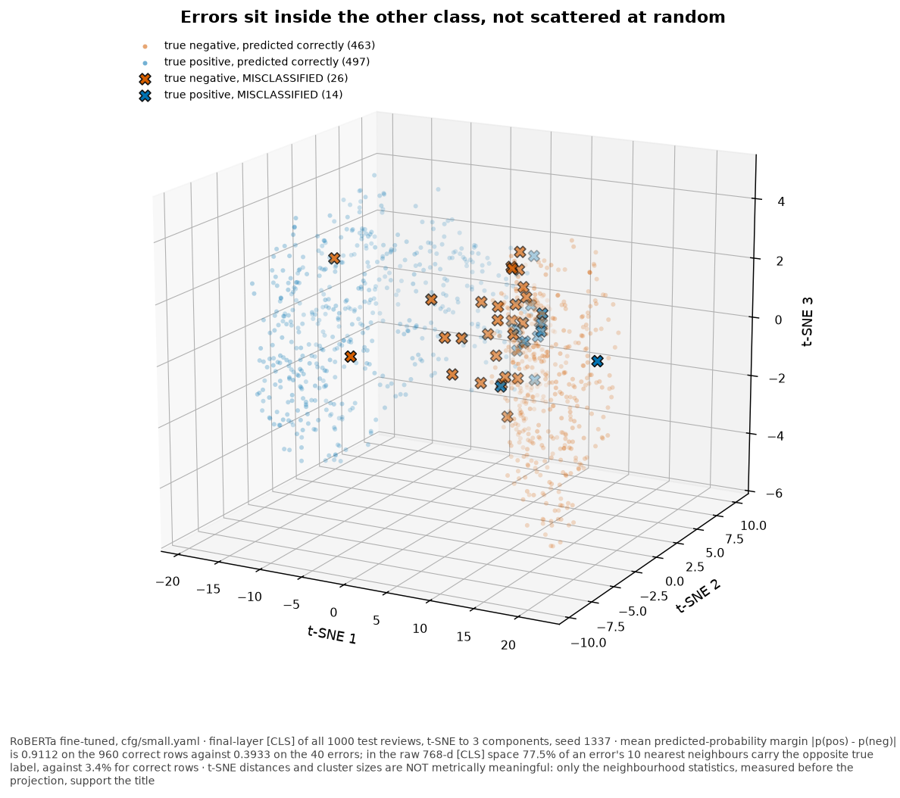
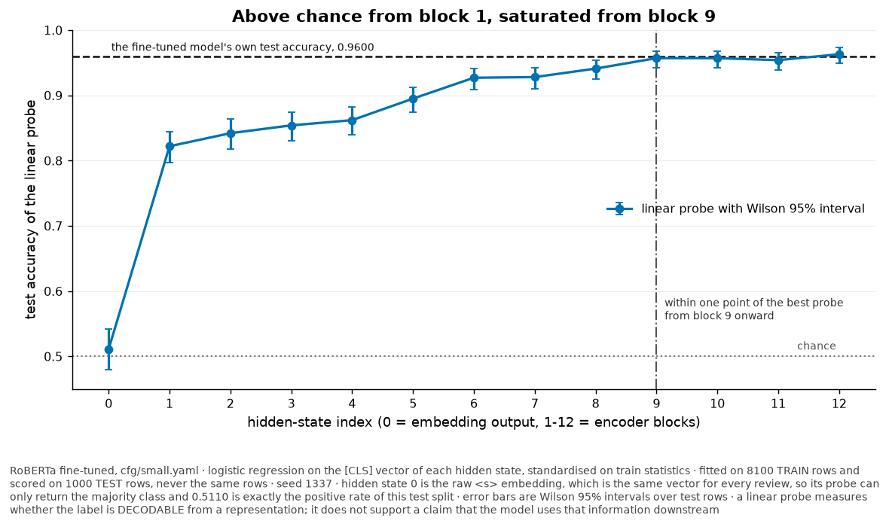
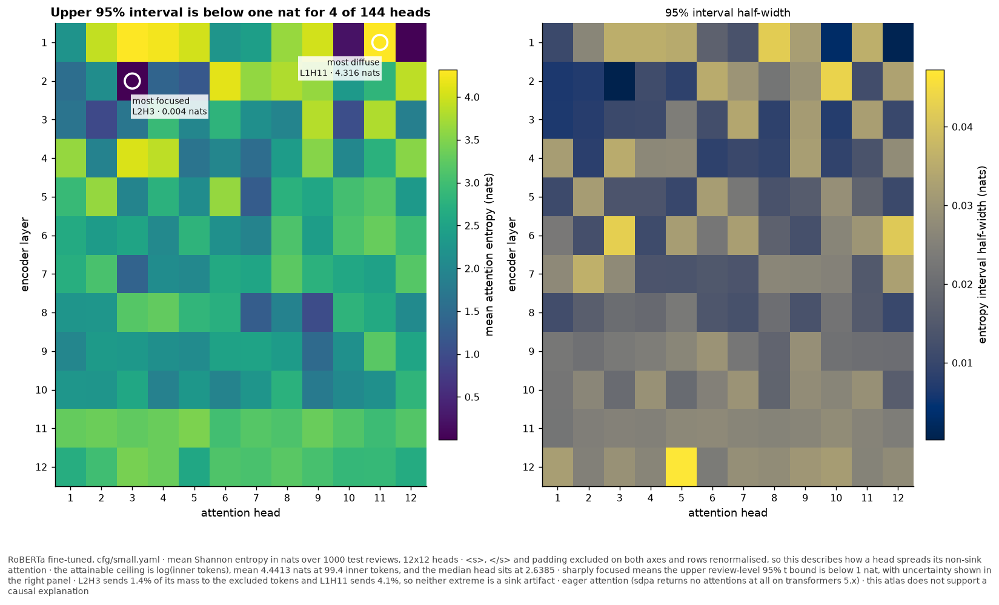

# Sentiment Polarity on Amazon Reviews: RoBERTa Fine-Tuning vs. a TF-IDF Control

[](https://github.com/armandogon94/Sentiment-RoBERTa/actions/workflows/ci.yml)
[](#testing)
[](#testing)
[](pyproject.toml)
[](LICENSE)

A reproducible fine-tuning study that reruns a published coursework notebook end to end and reports
the measured results. The tension: Amazon polarity is close to linearly separable in bag-of-words
space, while the notebook's own TF-IDF control used destructive preprocessing, unigrams, `C=1`, and
no validation tuning.

**Does fine-tuning `roberta-base` on 9,000 reviews beat TF-IDF + logistic regression by a margin that
survives a 1,000-example test set?**

## Original notebook comparison

<!-- original-notebook:start -->
On the original notebook's own 1,000-example test split, fine-tuned RoBERTa scored 0.952 versus
TF-IDF + logistic regression at 0.861, a 9.1 point gap, with both models evaluated on the same
512 negative / 488 positive rows.

| Model or class | Accuracy | Precision | Recall | F1 | Support | Confusion matrix |
|---|---:|---:|---:|---:|---:|---|
| Logistic regression | 0.861 | | | | 1,000 | [[451, 61], [78, 410]] |
| Logistic regression: Negative | | 0.85 | 0.88 | 0.87 | 512 | |
| Logistic regression: Positive | | 0.87 | 0.84 | 0.86 | 488 | |
| RoBERTa | 0.952 | | | | 1,000 | [[487, 25], [23, 465]] |
| RoBERTa: Negative | | 0.95 | 0.95 | 0.95 | 512 | |
| RoBERTa: Positive | | 0.95 | 0.95 | 0.95 | 488 | |

The notebook ran the full five epochs, used training loss only, and landed at 0.952. It had no
validation split and no validation tracking.

| Epoch | Training loss |
|---:|---:|
| 1 | 0.2364 |
| 2 | 0.1144 |
| 3 | 0.0706 |
| 4 | 0.0477 |
| 5 | 0.0397 |

Per-example predictions were not preserved, so no paired McNemar test, Wilson interval, or
discordance count is available for the notebook's comparison.
<!-- original-notebook:end -->

These values are transcribed from the owner's saved rendered Kaggle page and figures, with the
source notes in
[`reports/evidence/original_notebook/`](reports/evidence/original_notebook/).

This repository separately implements the notebook's logistic-regression recipe on its own
1,000-example split, which has 489 negative / 511 positive rows. On those different rows, RoBERTa
scores `0.9600` against the recipe implementation at `0.8480`, an internal 11.2 point gap. The
`0.8480` value is this repository's measurement, not the notebook's reported result.

Selecting on validation loss reaches `0.9600` in this repository. More epochs did not help: the
separate five-epoch repository run did not improve that selected-checkpoint result.

Against this repository's test-selected best TF-IDF cell, the gap is 9.0 pp: `0.9600` vs `0.8700`,
discordance 110 vs 20, exact McNemar p = 2.99e-16. That comparison is post hoc because the cell was
selected by maximum test accuracy, so it is descriptive rather than confirmatory.

- **Focus:** binary sentiment polarity, with token-level interpretability
- **Data:** [Amazon Review Polarity](https://huggingface.co/datasets/fancyzhx/amazon_polarity)
  (Zhang, Zhao & LeCun, NeurIPS 2015) · 3.6M train / 400K test available, public and ungated,
  Apache-2.0 · a documented 9,000-row subset is used, see [`data/README.md`](data/README.md)
- **Stack:** Python 3.12 · PyTorch 2.13 (MPS) · `transformers` 5.14 · scikit-learn · NLTK · statsmodels
- **Hardware:** Apple Silicon, 32 GB, **MPS fp32, no CUDA**. No cloud spend.
- **Output:** a measured leaderboard with Wilson intervals and a paired McNemar test, a four-cell
  preprocessing ablation, and eleven committed figures

📄 **[Read the full results & analysis →](reports/RESULTS.md)**

## Provenance

This began as a **coursework notebook for an M.S. Data Science and AI course** and was published
to Kaggle as
[Sentiment Analysis using RoBERTa](https://www.kaggle.com/code/armandogon94/sentiment-analysis-using-roberta)
(Apache-2.0). The original is preserved unmodified at
[`notebooks/sentiment_analysis_roberta_ORIGINAL.ipynb`](notebooks/sentiment_analysis_roberta_ORIGINAL.ipynb).

All 28 code cells in the preserved `.ipynb` were saved with `outputs: []` and
`execution_count: null`. The owner's saved rendered Kaggle page and figures retain the original
aggregate results transcribed above. The repository measurements below come from separate local
reruns on Apple Silicon. Provenance details are in [`docs/PROVENANCE.md`](docs/PROVENANCE.md).

---

## Key Findings

- **This repository's recipe reimplementation also favors RoBERTa on its different split.**
  `0.9600` [0.9460, 0.9705] against the recipe implementation's
  `0.8480` [0.8244, 0.8689]. They disagree on 152 of 1,000 test examples; RoBERTa alone is right on
  132 of those and the control alone on 20. Exact McNemar **p = 1.98e-21**. `cfg/small.yaml`.
- **Validation loss rose after epoch 1, which is why epoch 1 was selected.** In the measured
  3-epoch run, training loss fell every epoch (`0.2240` → `0.1001` → `0.0620`) while validation loss
  bottomed at epoch 1 (`0.1238`) and rose at epoch 2 (`0.1793`); validation accuracy was tied best at
  epochs 1 and 3 and worse at epoch 2. Falling train loss against rising validation loss is the
  signature of overfitting having begun, and it is the evidence the published checkpoint is chosen
  on.
- **Training the notebook's full 5-epoch schedule does not help.** `cfg/default.yaml` runs all five
  epochs on the same seeded split. Validation loss is lowest at epoch 1 (`0.1279`) and rises every
  epoch after it, ending at `0.2337`. Validation accuracy drifts up to `0.9522` at epoch 4 and then
  falls to `0.9344` at epoch 5, below its own epoch 1. Both criteria pick an early epoch, so the
  longer schedule buys nothing. The table is under
  [Epoch selection](#why-epoch-1-was-selected).
- **Conventional preprocessing may cost the control real points, but this comparison is
  underpowered.**
  Across the ablation grid the control moves `0.8380` → `0.8700` (3.2 pp). The best cell beats the
  notebook's chain by 2.2 pp, and the *paired* McNemar over their 140 disagreements gives
  **p = 0.0756**. Conditional exact power is 40.0%, and the paired difference CI includes zero;
  the presence or absence of an effect remains unresolved.
- **Adding bigrams to the notebook's chain makes it worse** (`0.8480` → `0.8380`). Once
  `not` / `no` / `n't` have been deleted, bigrams add 226,000 features and no signal. The same bigrams
  on negation-preserving text produce the best cell in the grid.
- **At `max_len=256`,** **0.1%** of test reviews (1 of
  1,000; median 92 tokens, p95 204, max 304) were truncated. The sequence budget was not a
  constraint here.

---

## Repository reimplementation results

| Model | Accuracy (Wilson 95% CI) | Precision (macro) | Recall (macro) | F1 (macro) | Train time | Config |
|---|---|---|---|---|---|---|
| **RoBERTa (fine-tuned)** | **0.9600** [0.9460, 0.9705] | 0.9605 | 0.9597 | 0.9600 | 32m 07.9s (MPS, Low Power Mode OFF) | `cfg/small.yaml` |
| TF-IDF + Logistic Regression (control): recipe reimplementation | 0.8480 [0.8244, 0.8689] | 0.8481 | 0.8478 | 0.8479 | 4.0s (CPU, Low Power Mode OFF) | `cfg/small.yaml` |

<sub>seed 1337 · n_train 8,100 (+900 validation) / n_test 1,000 · exact **McNemar p = 1.98e-21** on
152 discordant pairs · reproduce with <code>uv run python train.py -c cfg/small.yaml</code> · commit
<code>dcf8b09</code> · 124,647,170 parameters · epoch selected on validation loss, test set scored
once.</sub>

Within this repository's different split, the observed gap of 11.2 percentage points has McNemar
p = 1.98e-21; on this 1,000-example test set it is distinguishable from zero. The paired test
is the one that answers the
question: both models scored the *same* examples, so the effective sample size for the comparison
is the 152 disagreements, not the 1,000 rows.


### Repository control comparisons, with different evidentiary status

The `0.8480` row is this repository's **implementation of the original notebook's control recipe**
on this repository's different split: destructive preprocessing, unigram TF-IDF,
logistic-regression `C=1`, and no validation tuning. It does not represent the notebook's reported
result. The repository's stronger TF-IDF configuration appears in the next comparison.

The repo's own best TF-IDF cell scores `0.8700`. Paired against the saved RoBERTa predictions,
RoBERTa alone is correct on 110 discordant rows and that cell alone on 20; the 9.0 pp gap has exact
McNemar **p = 2.99e-16**. However, [`evaluate.py`](evaluate.py) selects this cell with
`max(cells, key=accuracy)` over test accuracy. It is therefore a post-hoc comparison, not a
confirmatory tuned-baseline result.

Two implementation details also differ from the source notebook and are part of the published run:
both models consumed `title + ". " + text`, not `title + " " + text`, and every TF-IDF cell used a
widened token pattern so the negation-preserving cells could retain `n't` and single-character
tokens. On the same published split, substituting sklearn's default token pattern produced 20,907
features and `0.8490` accuracy, versus 20,938 and `0.8480` for the widened pattern; seven predictions
differed. Against RoBERTa, the default-pattern control gives an exact McNemar probability of
**7.05e-22**, versus **p = 1.98e-21** for the published widened
pattern. Recompute without RoBERTa training:
`uv run python scripts/audit_methodology.py`.

### Baseline preprocessing ablation: the notebook's chain was deleting negation

The original chain was: lowercase → keep only `^\w+$` tokens → remove NLTK English stopwords → Porter
stem, then unigram TF-IDF. It deletes negation twice over: `not`, `no` and `nor` are NLTK English
stopwords, and the `^\w+$` filter destroys `n't` *before* the stopword filter runs. With unigrams
only, **`"not good"` and `"good"` become the same feature vector** on the one task where negation
decides the label. ([`tests/test_text_preprocess.py`](tests/test_text_preprocess.py) asserts exactly
that, in both directions.)

| Preprocessing | n-grams | Accuracy (Wilson 95% CI) | F1 (macro) | Vocabulary | Config |
|---|---|---|---|---|---|
| notebook chain (alnum filter + stopwords removed + Porter stem) | (1, 1) | 0.8480 [0.8244, 0.8689] | 0.8479 | 20,938 | `cfg/small.yaml` |
| notebook chain (alnum filter + stopwords removed + Porter stem) | (1, 2) | 0.8380 [0.8139, 0.8595] | 0.8378 | 247,041 | `cfg/small.yaml` |
| negation preserved (no filter, no stopword removal, no stemming) | (1, 1) | 0.8510 [0.8276, 0.8717] | 0.8510 | 30,449 | `cfg/small.yaml` |
| **negation preserved** (no filter, no stopword removal, no stemming) | **(1, 2)** | **0.8700** [0.8477, 0.8894] | 0.8700 | 275,634 | `cfg/small.yaml` |

<sub>Same splits, same seed 1337, same 1,000 test rows as the table above. Reproduce with
<code>uv run python train.py -c cfg/small.yaml -p cfg/baseline_ablation.json --baselines-only</code>.</sub>

**Interpretation: underpowered, not a null result.** Best cell against the notebook's chain is
2.2 points over 140 disagreements (81 vs 59), exact McNemar **p = 0.0756**. The conditional exact
95% CI for the paired accuracy difference is **[-0.22, 4.52] pp**. Conditional on those 140
discordant pairs, the exact test has **40.0% power** at the observed effect; approximately **3.5 pp**
would be needed for 80% power. The cell was also chosen by test accuracy, making the comparison post
hoc. The presence or absence of an effect remains unresolved. What is unambiguous is the mechanism:

| Cell | Negation markers among the 20 most negative coefficients |
|---|---|
| notebook chain, unigram | *none (deleted before vectorisation)* |
| notebook chain, uni+bigram | *none (deleted before vectorisation)* |
| negation preserved, unigram | `not`, `n't`, `no` |
| negation preserved, uni+bigram | `not`, `n't`, `no`, `not worth` |

The tokens the model would most like to use are simply absent from the first two rows. The best
cell still trails the transformer by 9.0 points, so **the negation-preserving bigram baseline does
not close the gap**.


### Why epoch 1 was selected


<sub>Training loss kept falling through epoch 3 while validation loss turned upward immediately
after epoch 1. The vertical rule marks epoch 1 as the checkpoint selected for its lowest
validation loss.</sub>

| Epoch | Train loss | Validation loss | Validation accuracy | Wall clock |
|---|---|---|---|---|
| **1** | 0.2240 | **0.1238** | 0.9456 | 10m 25.5s |
| 2 | 0.1001 | 0.1793 | 0.9389 | 11m 09.0s |
| 3 | 0.0620 | 0.1563 | 0.9456 | 10m 32.6s |

The published train and validation losses were computed as an **unweighted mean of batch means**.
Because 8,100 and 900 each leave a final batch of four at batch size 32, those three recorded loss
values are not per-example means. The bug is fixed for future runs; re-deriving the published losses
would require retraining, so the run history is retained exactly as recorded.

Validation accuracy used `correct / seen` and is unaffected: epoch 1 `0.9456`, epoch 2 `0.9389`,
epoch 3 `0.9456`. The published `0.9600` is epoch 1's test accuracy and is untouched.

What this 3-epoch run measured: validation loss bottomed at epoch 1 and rose at epoch 2 while
training loss kept falling, and validation accuracy never improved on epoch 1 through epoch 3. That
is why epoch 1 is the selected checkpoint.

#### The notebook's full 5-epoch schedule, measured

`cfg/default.yaml` is the notebook's untruncated schedule. It runs the same 8,100 / 900 / 1,000
split at seed 1337, so its curve is directly comparable to the three epochs above.

| Epoch (5-epoch schedule) | Train loss | Validation loss | Validation accuracy | Wall clock |
|---|---|---|---|---|
| **1** | 0.2276 | **0.1279** | 0.9456 | 9m 33.0s |
| 2 | 0.0999 | 0.1471 | 0.9489 | 10m 44.5s |
| 3 | 0.0598 | 0.1499 | 0.9478 | 10m 31.7s |
| 4 | 0.0429 | 0.1734 | 0.9522 | 17m 13.4s |
| 5 | 0.0348 | 0.2337 | 0.9344 | 9m 16.4s |

**More training does not help here.** Validation loss is lowest at the first epoch and increases at
every epoch after it. Validation accuracy is the more interesting column: it improves to `0.9522` at
epoch 4, which is better than any epoch of the 3-epoch run, and then drops to `0.9344` at epoch 5,
below where it started. So the two selection criteria disagree in the middle of the schedule and
agree at the end: neither one would choose epoch 5. Selection here is on validation loss, fixed
before the run, and it picks epoch 1.

Rising validation loss against a validation accuracy that is still improving is the signature of a
model becoming overconfident rather than simply wrong: it is right slightly more often while being
badly wrong on the cases it misses, and cross-entropy charges for that.

Scored once on its selected epoch-1 checkpoint, this run reaches `0.9560` [0.9414, 0.9671] on the
same 1,000 test rows. Its paired comparison against the control is recomputed from
[`reports/evidence/run_5/`](reports/evidence/run_5) by the numbers gate rather than restated here.
The published `cfg/small.yaml` headline of `0.9600` comes from a separate run at the same seed and
split; the two differ by four test examples, which is inside the run-to-run spread recorded in
Limitations. The published headline is not re-selected from these two numbers, because picking
between runs by test accuracy is the move this repo's method exists to avoid.

The epoch timings above are wall clock on a shared machine: epoch 4 ran under load from other work
and is not a clean benchmark. The whole run took 57m 19.1s, and `cfg/default.yaml` carries a
90-minute cap so that all five epochs complete rather than being truncated.

---

## Interpretability

This section reports gradient-norm saliency and attention for selected examples.

### Gradient-norm saliency: method and input path


**Method.** The notebook called this "Grad-CAM". It computes
`‖∂logit_target/∂embedding_t‖₂`: gradient-norm saliency. Grad-CAM pools gradients per channel and
weights the *activations* of a chosen layer, then applies ReLU. Different method, different
guarantees.

**Input path.** The gradient is taken w.r.t. the *word* embeddings only. The notebook's version was
computed on a distorted input:

```python
embeddings = model.roberta.embeddings(input_ids=input_ids)  # the FULL embedding module
outputs = model(inputs_embeds=embeddings, attention_mask=mask)
```

`RobertaEmbeddings.forward` does word lookup **plus** position embeddings, token-type embeddings,
LayerNorm and dropout. Passing its output back in as `inputs_embeds` runs all of that a *second*
time. Every attribution the notebook produced was taken on an input distribution the model had never
seen in training. In `eval()` mode dropout is off, so the word-embedding path must reproduce the
`input_ids` logits bit for bit:

```text
logits(input_ids)  vs  logits(word_embeddings(input_ids))   →  max |Δ| = 0.0     ← the fix
logits(input_ids)  vs  logits(FULL embeddings(input_ids))   →  max |Δ| ≠ 0       ← the bug
```

Both assertions live in [`tests/test_attribution.py`](tests/test_attribution.py), with the broken
path represented by a strict `xfail` that names the bug. A third test proves the two paths differ,
which prevents a vacuous `xfail`.

### Attention


`<s>` and `</s>` are excluded: RoBERTa's `<s>` is an attention sink, and leaving it in flattens every
real token to the bottom of the colour scale.

The notebook passed
`attn_implementation="eager"` to `RobertaConfig.from_pretrained`, where nothing reads it;
`transformers` reads the private `config._attn_implementation`. On `transformers` 5.x the default is
`sdpa`, and **`sdpa` returns an empty attentions tuple with only a warning**, so today that code
would produce blank figures rather than slightly wrong ones. Verified locally:

```text
attn_implementation="sdpa"   →  len(out.attentions) == 0
attn_implementation="eager"  →  len(out.attentions) == 12
```

`interpretability/attention.py` now raises on a non-eager model instead of plotting nothing.

### Representation geometry, layer-wise decodability, and the head atlas

Three further figures read the checkpoint's internals rather than its outputs. All three come out
of the same `scripts/export_figures.py` invocation as the eight above, from the same `runs/run_2`
weights, with no retraining: forward passes only.



**What it shows.** The final-layer `[CLS]` vector of all 1,000 test reviews, reduced to three
components with t-SNE and coloured by *true* label. The `40` misclassified reviews are drawn as
crosses, and they are not scattered at random: they carry a mean predicted-probability margin of
`0.3933` where the `960` correct rows average `0.9112`, and on the raw logits the two means are
`1.1728` and `4.2794`. Measured in the raw 768-dimensional `[CLS]` space rather than in the
projection, `77.5%` of an error's `10` nearest neighbours by cosine distance carry the opposite
true label, where correct rows sit at `3.4%`. The errors are not merely near the frontier; they are
on the far side of it.

**What it does not support.** t-SNE distances and cluster sizes are not metrically meaningful. The
method preserves neighbourhoods, not distances, and a cluster's diameter is an artifact of the
perplexity rather than a property of the data. The claim above rests on the margin and neighbour
statistics, both measured in the original space. The projection is there to be looked at, not to be
measured.



**What it shows.** One logistic regression per hidden state, fitted on the run's 8,100 train rows
and scored on its 1,000 test rows, never on the same rows. `roberta-base` exposes 13 hidden states:
the embedding output plus 12 encoder blocks.

| Hidden state | 0 | 1 | 2 | 3 | 4 | 5 | 6 | 7 | 8 | 9 | 10 | 11 | 12 |
|---|---|---|---|---|---|---|---|---|---|---|---|---|---|
| Probe accuracy | 0.5110 | 0.8220 | 0.8420 | 0.8540 | 0.8630 | 0.8960 | 0.9270 | 0.9280 | 0.9410 | 0.9560 | 0.9580 | 0.9530 | 0.9630 |

Hidden state 0 is the embedding of `<s>` at position 0, the same vector for every review, so its
probe can only return the majority class at `0.5110`, which is exactly the positive rate of this
test split. One block of self-attention lifts that to `0.8220`. The curve then climbs steadily: the
probe peaks at `0.9630`, and from block `9` onward it stays within one accuracy point of that peak.
Blocks 9 through 12 span a single accuracy point, which is inside the noise of a 1,000-row test
set.

**What it does not support.** A linear probe measures whether the label is *decodable* from a
representation, not that the model uses that information downstream. The probe is a second model
fitted on these activations, not a read-out of the network's own computation, so a feature it can
read is not thereby a feature the classification head reads.



**What it shows.** The mean Shannon entropy of every one of the 12 x 12 attention distributions,
over the same 1,000 test reviews. `<s>`, `</s>` and padding are dropped from both axes and the
surviving rows renormalised, for the reason the attention module already gives: `<s>` is an
attention sink, and leaving it in flattens the scale. Low entropy is a focused head, high entropy a
diffuse one. The attainable ceiling is `log(inner tokens)`, mean `4.4413` nats at `99.4` inner
tokens per review. The median head sits at `2.6385` nats, and only `4` of the 144 fall below 1 nat,
so a sharply focused head is the exception rather than the rule. The extremes are `L2H3` at
`0.0039` nats and `L1H11` at `4.3160` nats: effectively a delta and effectively uniform. Neither is
a sink artifact, because they send `1.4%` and `4.1%` of their raw mass to the excluded tokens.

**What it does not support.** Entropy describes how a head spreads its weight and nothing more.
Attention weight is not causal importance, so a focused head is not thereby an important one, and
the atlas says nothing about what any head is focused *on*. Excluding `<s>` also means this is
non-sink attention: a head's full behaviour includes the mass the figure removes.

**What these figures do not claim:** attention weight is not causal importance, gradient-norm
saliency satisfies none of Integrated Gradients' axioms, and a linear probe measures decodability
rather than use. Full treatment in
[`docs/interpretability.md`](docs/interpretability.md).

---

## Architecture

```mermaid
%%{init: {'htmlLabels': false, 'fontFamily': 'arial, helvetica, sans-serif', 'flowchart': {'htmlLabels': false, 'padding': 16, 'nodeSpacing': 60, 'rankSpacing': 70, 'useMaxWidth': true}}}%%
flowchart LR
    HF[("fancyzhx/amazon_polarity<br/>parquet · 3.6M / 400k · Apache-2.0")]
    HF -->|"scripts/download_data.py<br/>SHA-256 asserted per shard"| RAW["data/raw/*.parquet<br/>gitignored, 377 MB"]
    RAW -->|"scripts/make_sample.py<br/>stratified, seed 1337"| SAMPLE["data/sample/*.csv<br/>1,400 rows · COMMITTED"]

    RAW --> LOAD["datasets/loading.py<br/>label∈{0,1} / title / text"]
    SAMPLE --> LOAD
    LOAD -->|"datasets/splits.py<br/>stratified, seeded"| SPLIT{{"train · val · test"}}

    SPLIT --> BASE["models/baselines.py<br/>TF-IDF + LogReg"]
    SPLIT --> ROB["models/roberta.py<br/>roberta-base, MPS<br/>epoch chosen on VAL loss"]

    BASE --> RUN[["runs/run_N/<br/>metrics.json · predictions.parquet<br/>run_meta.json · history.json"]]
    ROB --> RUN

    RUN -->|"metrics/significance.py"| SIG["Wilson CIs<br/>exact McNemar"]
    SIG --> RUN
    RUN -->|"evaluate.py"| REP["reports/RESULTS.md"]
    RUN -->|"scripts/export_figures.py"| FIG["docs/images/*.png"]
```



Both models consume the *same* `Splits` object and write into the *same* run directory in one
process. This gives the leaderboard a shared evaluation basis and supplies the paired predictions
that McNemar requires for the same 1,000 rows in one `predictions.parquet`.

A second diagram, a sequence diagram of the attribution path where the
double-embedding bug lived, is in [`docs/architecture.md`](docs/architecture.md). Both are exported
to [`docs/diagrams/`](docs/diagrams) as SVG by `scripts/export_diagrams.sh`.

---

## Repository Structure

```bash
Sentiment-RoBERTa/
├── cfg/                      # 5 YAML configs + Pydantic schema; *.json = the ablation grid
├── data/                     # gitignored except data/sample/; provenance in data/README.md
├── datasets/                 # loading, stratified splits, the TF-IDF chain, torch Dataset
├── models/                   # TF-IDF control + RoBERTa behind one Protocol, plus the registry
├── metrics/                  # classification metrics · Wilson CIs · exact McNemar
├── interpretability/         # attention · gradient saliency (the D1 fix) · [CLS] probes + entropy
├── utils/                    # seeding, device, run dirs, run metadata, logging, plots, NLTK
├── notebooks/                # the ORIGINAL Kaggle notebook + a re-run narrative walkthrough
├── scripts/                  # data export | evidence export/check | figure/report drift guards
├── tests/                    # 225 tests: leakage, metrics, evidence, probes, D1, D3, D8, smoke
├── reports/                  # RESULTS.md + text-free evidence/ + mirrored publication figures/
├── docs/                     # PROVENANCE · architecture · interpretability · adr/ (7 ADRs)
├── train.py                  # THE entrypoint: train.py -c cfg/small.yaml
├── evaluate.py               # explicit run/evidence artifacts → reports/RESULTS.md
└── Makefile                  # setup | smoke | train | evidence | figures | report | test
```

---

## Quickstart

```bash
git clone https://github.com/armandogon94/Sentiment-RoBERTa.git
cd Sentiment-RoBERTa
make setup          # uv sync + pre-commit hooks
make smoke          # full pipeline on data/sample/, CPU, ~6 s
make test           # test suite; exact collected count is stated under Testing
```

`make smoke` runs the full pipeline with random weights on the committed sample. It verifies the
pipeline wiring; the random-weight accuracy is excluded from reported results.
It does not fetch review data or Hugging Face weights. It does require NLTK `punkt`, `punkt_tab`, and
`stopwords`; on a cold machine, `ensure_nltk_data()` downloads them by mutable package name.

To reproduce the published numbers (~377 MB download, ~35 min on Apple Silicon):

```bash
make data
make dev
make small
PUBLISHED_RUN="$(python3 -c 'from pathlib import Path; print(Path("runs/latest").resolve())')"
make ablation
ABLATION_RUN="$(python3 -c 'from pathlib import Path; print(Path("runs/latest").resolve())')"
make evidence PUBLISHED_RUN="$PUBLISHED_RUN" ABLATION_RUN="$ABLATION_RUN"
make report   PUBLISHED_RUN="$PUBLISHED_RUN" ABLATION_RUN="$ABLATION_RUN"
make figures  PUBLISHED_RUN="$PUBLISHED_RUN" ABLATION_RUN="$ABLATION_RUN"
```

The two variables capture the actual directories before `runs/latest` advances. The evidence export
requires the published and ablation runs; calibration and smoke runs are not substitutes. The
evidence exporter maps the two exact, allowlisted prediction schemas to the published `run_2` and
ablation `run_3` bundle slots.

**Requires** Python 3.12+ and [uv](https://docs.astral.sh/uv/). No CUDA, no Docker, no cloud account.

---

## Configuration

Five configs. **Each file records whether it was run:** four were run and one was not. Reported
measurements come only from completed runs.

| File | Scale (train / val / test) | Epochs | Ran? | Purpose |
|---|---|---|---|---|
| `cfg/smoke.yaml` | committed sample, random weights, CPU | 1 | ✅ | CI + fresh clone pipeline check; excluded from reported results. |
| `cfg/dev.yaml` | 1,800 / 200 / 500, seq 128 | 1 | ✅ | Calibration. Its numbers are labelled `dev` wherever they appear. |
| `cfg/small.yaml` | 8,100 / 900 / 1,000, seq 256 | 3 | ✅ | **Every headline number above.** |
| `cfg/default.yaml` | 8,100 / 900 / 1,000, seq 256 | 5 | ✅ | The notebook's untruncated schedule. Ran 57m 19.1s under a 90-minute cap; it is the evidence that more epochs do not help. |
| `cfg/full.yaml` | 180,000 / 20,000 / 20,000 | 5 | ❌ | Scope specification only; no runtime is claimed without a full run or matched benchmark. |

`cfg/small.yaml` is the notebook's data scale and every one of its hyperparameters, with two stated
departures. It uses 3 epochs instead of 5 to stay within the compute bound established from a
measured 2.46 s/step. It also adds a 10% stratified validation split for checkpoint selection, which
the notebook lacked. `cfg/default.yaml` keeps the notebook's 5 epochs and has been run: the epoch
table above shows that the two extra epochs cost accuracy rather than adding it, so the shorter
schedule loses nothing.

Every future run is bounded. `train.py` checks the deadline before every optimizer step, including
epoch 1. It can exceed the configured cap only by the in-flight step, then records the partial epoch
and saves the best completed validation checkpoint or the partial model if none exists yet. It also
refuses to start above a 1-minute load average of 12 without `--force`.

<details>
<summary>Example <code>cfg/small.yaml</code></summary>

```yaml
SEED: 1337
DATA:
  TRAIN_PATH: data/raw/train.parquet
  ROWS_READ_TRAIN: 200000        # rows parsed from the parquet…
  N_TRAIN: 9000                  # …of which this many are used. Two knobs, not a coincidence.
  N_TEST: 1000
  VAL_FRACTION: 0.1
MODEL:
  PRETRAINED: roberta-base
  REVISION: null               # fill from the first online run; never guess a hash
  MAX_LEN: 256
  BATCH_SIZE: 32
  EPOCHS: 3
  LR: 2.0e-5
RUNTIME:
  DEVICE: auto
  WALL_CLOCK_CAP_MIN: 45.0       # checked inside epoch 1 and every later epoch
```
</details>

---

## Reproducibility

- **One experiment seed, `1337`**, threaded through the sample, split, vectorizer, estimators,
  `torch`, and `torch.mps`. `PYTHONHASHSEED` must exist before interpreter startup; the Makefile and
  CI export it correctly. `set_seed()` also records the intended value in the process environment
  for child processes, but cannot change the running interpreter's hash randomisation. Direct local
  commands require `PYTHONHASHSEED=1337 uv run python ...`.
- **Model revision is now an explicit config field** threaded through both Hugging Face
  `from_pretrained` calls and written to `run_meta.json`. It remains `null` because the published run
  did not record a resolved revision. The first online run can record the observed immutable
  revision.
- **Every run writes `runs/run_N/run_meta.json`**: git SHA, resolved config, requested model
  revision, library versions, device, macOS Low Power Mode state, split-overlap audit, and launch
  load average.
- **Content overlap is audited, not inferred from separate source files.** On the 200,000-row train
  and 20,000-row test prefixes, the audit found zero exact overlaps and six normalized
  near-duplicates. The selected 8,100/900/1,000 split has zero exact and zero normalized overlap
  across every train/validation/test pair; future runs refuse to train if that audit is nonzero.
  Recompute with `uv run python scripts/audit_methodology.py`.
- **Per-example predictions are persisted** to `runs/run_N/predictions.parquet`, so McNemar can be
  recomputed without re-training.
- **A primary-evidence bundle is committed** at
  [`reports/evidence/`](reports/evidence/): source JSON copied verbatim plus labels, prediction
  vectors, and SHA-256 review identifiers, never review text. `scripts/check_published_numbers.py`
  recomputes the accuracies, confusion/discordance tables, Wilson intervals, and exact McNemar p,
  then checks the published comparison, ablation, training-history, truncation, and parameter
  headline claims numerically at their displayed precision.
- **The numbers above were produced by commit `dcf8b09`**, on MPS with Low Power Mode OFF. That is
  the SHA `run_meta.json` recorded at run time, and it does not resolve in the published history: a
  third-party reviewer's contact detail was later redacted from `data/sample/reviews_sample.csv`
  with `git-filter-repo`, which renumbered every commit from that file's introduction onward.
  Reproduction is checked against the committed evidence bundle, not against the SHA.
- **Timing conditions are recorded.** Both runs happened with other work on the machine
  (1-minute load average 9.5 at the launch of the published run). They are pessimistic upper bounds,
  not clean benchmarks.

## Testing

```bash
make test           # 225 tests, coverage on the pure-logic core
make lint           # ruff check + ruff format --check + mypy
make verify         # clone committed HEAD to a temp dir and run the documented quickstart
```

**225 tests (one expected `xfail`), 96% coverage** on
`datasets/ models/ metrics/ interpretability/ utils/`. No test fetches review data or Hugging Face
weights; preprocessing tests still require the mutable-name NLTK assets and can download them on a
cold machine. Selected tests:

| File | Asserts |
|---|---|
| `test_attribution.py` | **D1:** `logits(input_ids) ≈ logits(word_embeddings(ids))`, plus a strict `xfail` reproducing the double-embedding bug and a guard so it cannot go vacuous |
| `test_text_preprocess.py` | **D3:** `"not good"` and `"good"` collapse to one vector under the notebook's chain and separate under the fixed one |
| `test_splits.py` | leakage: disjoint index sets, no shared text, and a vectorizer vocabulary provably free of a marker token present in every test row |
| `test_loading.py` | the label-flip trap: HF `{0,1}` and Kaggle `{1,2}` must normalise to identical frames |
| `test_metrics.py` | Wilson against `statsmodels` to 1e-9; McNemar against a 2×2 computed by hand in the docstring |
| `test_evidence.py` | deterministic text-free export; consistent bundle passes; one flipped prediction fails by metric name; scientific-notation precision |
| `test_attention.py` | **D8:** an `sdpa` model raises rather than silently plotting nothing |
| `test_utils.py` | parses every `.py` with `ast` to prove no unguarded `plt.show()` survives |

CI runs lint → types → tests → a smoke train on Python 3.12 and 3.13, plus independent documentation
and published-evidence jobs. The smoke job has local review data, random weights, and a local
tokenizer, but its TF-IDF path still requires NLTK assets and is not a cold-machine offline
guarantee. The evidence job recomputes headline statistics from committed prediction vectors,
regenerates figure provenance, and requires `reports/RESULTS.md` to be byte-reproducible.

---

## Limitations

1. **8,100 training rows: 0.22% of the 3.6M available.** Laptop-scale by choice. These results do not
   transfer to full-data training, where the literature reports single-digit error rates for both
   model families.
2. **The 2.2 pp ablation comparison is underpowered.** Its conditional exact paired 95% CI is
   [-0.22, 4.52] pp and conditional power is 40.0% at the observed effect; approximately 3.5 pp
   would be required for 80% power with the same discordance. Marginal Wilson-interval overlap is
   not used to decide a paired difference.
3. **One seed, one split, one run per config, and run-to-run variance is measurably non-zero.**
   `cfg/dev.yaml` was executed twice, once by `train.py` and once by the narrative notebook,
   which differ only in *where* `set_seed` sits relative to model construction, and therefore in
   how much RNG state the classifier head's initialisation consumes. They produced **0.9460** and
   **0.9560**, a 1.0-point spread from RNG-consumption order alone, on identical data with an
   identical seed. (`0.9460` is in `runs/run_1/metrics.json`; `0.9560` is in the saved output of
   cell 12 of [`notebooks/sentiment_analysis_roberta.ipynb`](notebooks/sentiment_analysis_roberta.ipynb),
   because the notebook does not create a run directory.) Every point estimate in this repo should
   be read with that in mind. Running `cfg/small.yaml` across several seeds and reporting
   mean ± stdev has not been done; no multi-seed number is published, because none was measured.
4. **MPS fp32 only:** no mixed precision, no `torch.compile`. Timings are not comparable to CUDA
   figures in papers, and both runs shared the machine with other work.
5. **Gradient-norm saliency is not axiomatically attributive.** It is a first-order local
   sensitivity; where a logit has saturated, gradients are small regardless of importance. Integrated
   Gradients is the principled upgrade and is not implemented here.
6. **Attention weights are not explanations.** High attention is not causal importance. These figures
   show where the model looks, which is a weaker claim than attribution.
7. **Amazon reviews circa 2013.** Domain shift to any other review corpus is unmeasured.
8. **The saliency and attention figures use hand-picked reviews:** the notebook's
   `iloc[5, 7, 9, 11, 13, 16]`, kept so the notebook and this README discuss the same examples. They
   illustrate; they do not measure. The embedding-space, layer-probe and entropy-atlas figures read
   the whole test split instead, so those three do measure, on one seed and one split.
9. **`cfg/full.yaml` has not been run.** Full-scale results are not available.
10. **The 5-epoch schedule was measured on one seed.** The epoch-4 validation accuracy of `0.9522`
    exceeding every epoch of the published run is a single observation on 900 validation examples,
    which is roughly 4 examples wide. It is not enough to justify moving the selection criterion off
    validation loss, and it is reported because it complicates the story rather than because it
    settles it.
11. **A linear probe measures decodability, not use.** That a logistic regression recovers the label
    from a hidden state says the information is present and linearly available there. It is not
    evidence that the model's own classification head uses it, and it locates no mechanism.
12. **t-SNE is for looking at, not for measuring.** It preserves neighbourhoods rather than
    distances, and a cluster's diameter is a function of the perplexity. Every quantitative claim
    made alongside the 3D scatter is computed in the original 768-dimensional space.

## Data

[Amazon Review Polarity](https://huggingface.co/datasets/fancyzhx/amazon_polarity): 3.6M train /
400K test, Apache-2.0, public and ungated, constructed for
[Zhang, Zhao & LeCun, *Character-level Convolutional Networks for Text Classification*, NeurIPS 2015](https://papers.nips.cc/paper_files/paper/2015/hash/250cf8b51c773f3f8dc8b4be867a9a02-Abstract.html).

Not committed. Two small stratified samples are (1,400 rows, 615 KB total), so tests and the
quickstart need no review-data download. Measured class balance of the rows actually read is 50.58% positive
in the first 200,000 train rows and 51.07% in the first 20,000 test rows. The schema, both
provenance URLs, and the shard checksums are in [`data/README.md`](data/README.md).

## License

**Apache-2.0:** see [LICENSE](LICENSE). This matches the licence of the original Kaggle notebook
this repo was built from. Third-party attributions (`roberta-base` weights, MIT; the dataset,
Apache-2.0 *as asserted by its upstream card*) are in [NOTICE](NOTICE).

**Scope of that claim.** Those licences are recorded as upstream assertions, not as an independently
verified rights chain. This repository commits 1,400 verbatim third-party review texts, and it does
**not** establish the rights position for that underlying text. Amazon's terms, reviewer rights, and
the original McAuley-Leskovec collection terms are all unaddressed here. See
[`docs/PROVENANCE.md`](docs/PROVENANCE.md#scope-of-the-licence-evidence) for the full scoping. The
committed sample illustrates the pipeline and is not licence-cleared redistribution.

## Author

**Armando Gonzalez, AI/ML Engineer, M.S. in Data Science and AI**
