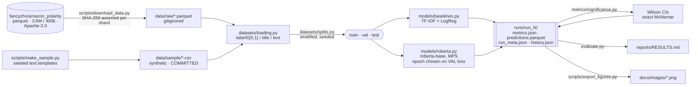
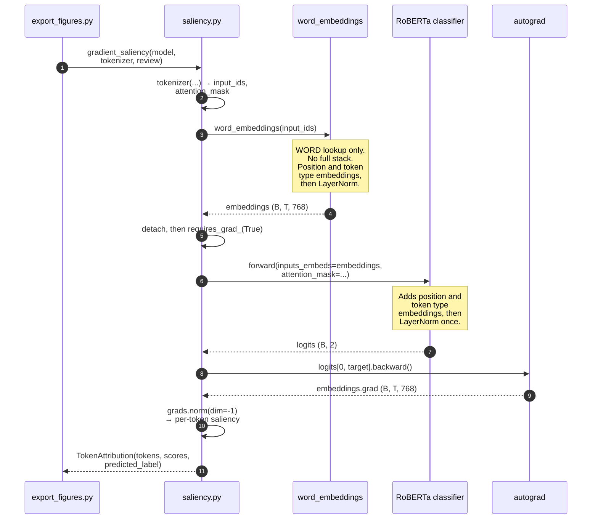

# Architecture

Two diagrams. Both are inline Mermaid (GitHub renders them natively) and both are exported to
[`diagrams/`](diagrams/) as SVG so they survive outside a Markdown renderer.

---

## 1. The pipeline DAG

**The decision this encodes.** Both models consume the *same* `Splits` object and write into the
*same* `runs/run_N/` directory in one process. That is what makes the leaderboard a like-for-like
comparison rather than two numbers that happen to sit in one table, and it is what makes McNemar
possible at all, because the paired predictions for both models exist for the same 1,000 test rows in
one `predictions.parquet`. The upstream train and test rows come from different physical files, but
that alone does not prove content disjointness. `train.py` now records and enforces an exact and
normalized content-overlap audit; the published split audit found zero overlap by either rule.

---

## 2. The attribution path: where the D1 bug lived

**The decision this encodes, and why it earns its place.** Step 3 is the entire bug. The source
notebook called `model.roberta.embeddings(input_ids=input_ids)`, the full `RobertaEmbeddings`
module, and passed the result back in as `inputs_embeds`. `RobertaForSequenceClassification` then
ran that output through `RobertaEmbeddings.forward` a *second* time, adding position and token-type
embeddings twice and applying LayerNorm twice. Every attribution was computed on an input the model
had never seen in training.

The fix is one line, and the diagram is the argument for it: there is exactly one arrow into the
embedding module, and the note on step 6 states the invariant that arrow preserves. The property is
testable and is tested: in `eval()` mode dropout is off, so `logits(input_ids)` must equal
`logits(word_embeddings(input_ids))` exactly, while the old path does not
([`tests/test_attribution.py`](../tests/test_attribution.py), where the broken path is kept as a
strict `xfail`).

---

## Why there is no service diagram

This is a research repo. It has a config-driven entrypoint, a run directory, and a
report: no frontend, no API, no database, no tracking server. Ports `3330` / `8330` / `5433` /
`9330` are reserved in [`ports.example.md`](ports.example.md) so nothing in this repo can ever
collide with another project on the same machine; **none of them is bound.** Reserving a port and
running nothing on it is the correct outcome, not an oversight.
